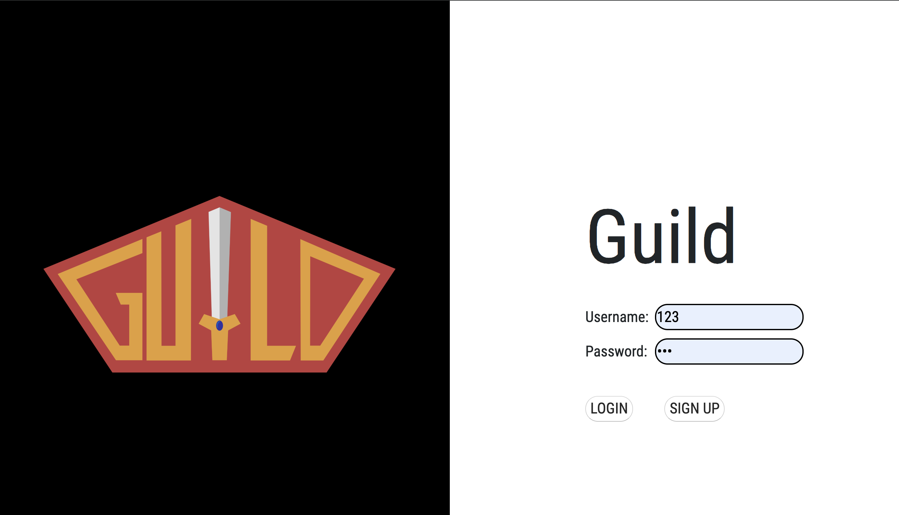
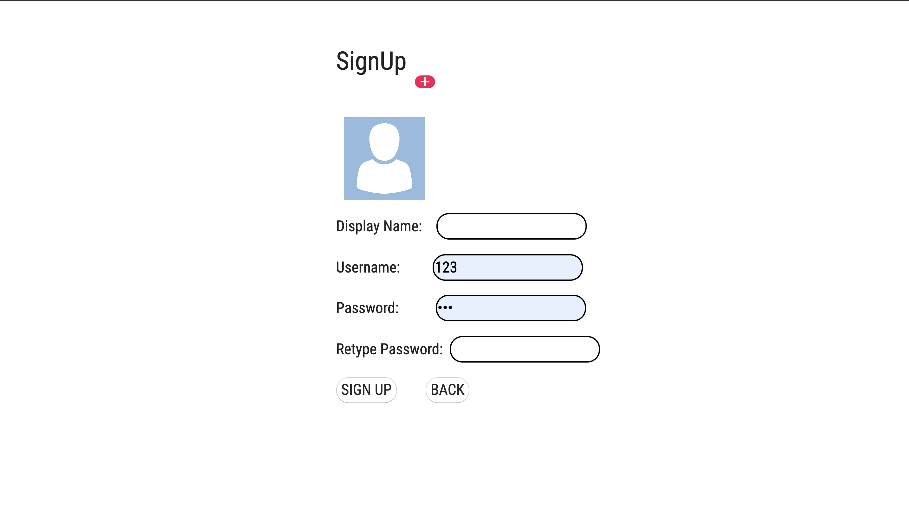
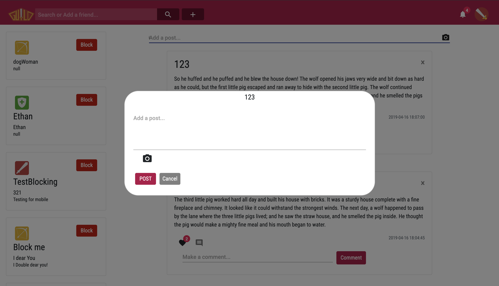
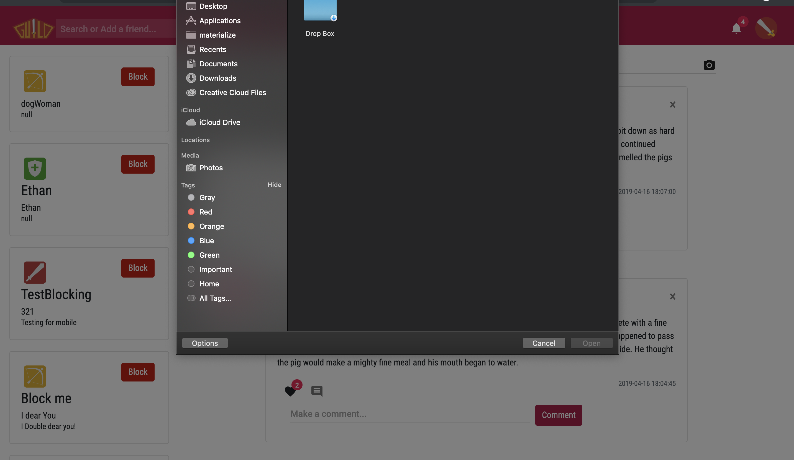

# Guild
An Intimate Social Media Application

Table of Contents
=================
1. [ Link ](#link) 
2. [ Website Preview ](#preview)
3. [ Gantt Chart ](#ganttChart)
4. [ Sources ](#source)

## LINKS
1. [API WRITEUP](API/README.md)
2. [JSON Web Tokens Introduction](http://jwt.io)

## Website Preview
Login Page

Signup Page

Posting Content Page

Previewing Images During Upload 

## Gantt Chart

